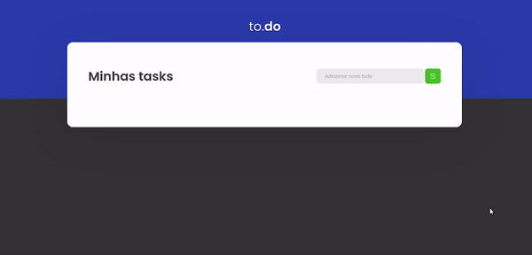
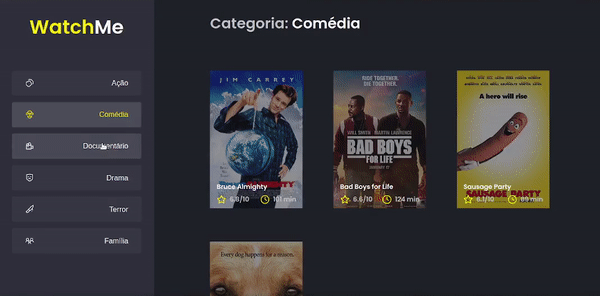
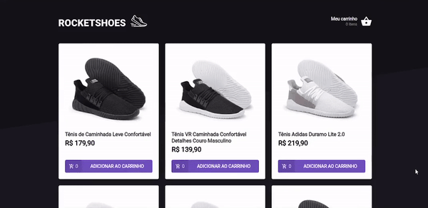

<h3 align="center">
  Desafios da Trilha React - Ignite
</h3>

  
  
  

 

## :rocket: Sobre os desafios

:book: Desafios finalizados da Trilha React, do Ignite

 

## :memo: Desafio 01 - Conceitos do React

Nesse desafio, o principal objetivo é desenvolver uma pequena aplicação de atividades a fazer, para treinar um pouco mais sobre manipulação do estado no React.

  

 

## :memo: Desafio 02 - Componentizando a aplicação

:book: Nesse desafio, o principal objetivo é refatorar uma página para listagem de filmes de acordo com gênero.

  

 

## :memo: Desafio 03 - Criando um Hook de carrinho de Compras

:book: Nesse desafio, o principal objetivo é criar um hook para gerenciar um carrinho de compras.

  

 

## :memo: Desafio 04 - Refactoring classes para Typescript e de Class Components para Function Components.

:book: Nesse desafio, o principal objetivo é realizar dois processos de migração: de Javascript para Typescript e de Class Components para Function Components.

  

 

## 🚀 Como executar o projeto

### Pré-requisitos

Antes de começar, você vai precisar ter instalado em sua máquina as seguintes ferramentas:
[Git](https://git-scm.com), [Node.js](https://nodejs.org/en/) e o gerenciador de pacotes [Yarn](https://yarnpkg.com).
Além disto é bom ter um editor para trabalhar com o código como [VSCode](https://code.visualstudio.com/)

 

## :memo: Licença

Esse projeto está sob a licença MIT. Veja o arquivo [LICENSE](/LICENSE) para mais detalhes.

 

## :man_technologist: Autor

Feito com ❤️ por Savio Lopes 👋🏽 [Entre em contato!](https://www.linkedin.com/in/savio-lopes/)

 

## 💙 Agradecimentos

Meus agradecimentos à [Rocketseat](https://rocketseat.com.br/) por disponibilizar esse conteúdo sensacional 🚀.
